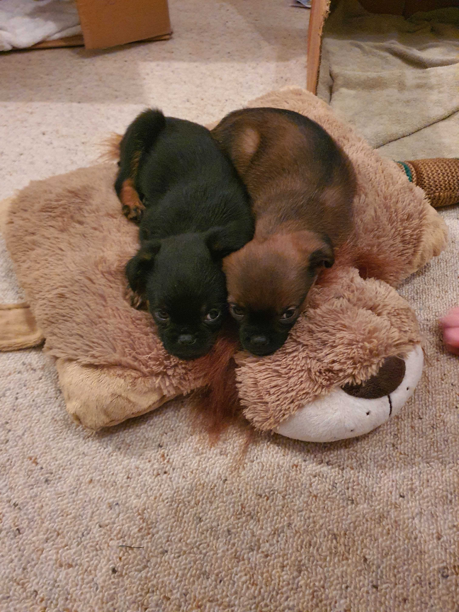

### What to expect from me (as your tech lead)

Heavily inspired by [molly/manager-README](https://github.com/molly/manager-README).

### Hi I'm Otis

I can't wait to meet you! I created this document to give you a brief overview of who I am, how I operate, and what makes me tick ⚡.

### My Role

My primary goal is looking after the development team 💻 I try to make their lives as easy and productive as possible!

To make this goal a reality I prioritise the following tasks:

- 🚀 Team alignment, this means making sure we are all on the same page and have the same goals
- 👽 Technical vision, making sure the team understands the product and what it will become moving forward
- 🌿 Growth of technical knowledge, I want to help the team to improve as much as possible all the time, this is not limited to just technical development even if this is the main focus
- 🍡 Technical risk management, this involves actively thinking about the product and all it's moving parts and trying to identify risk proactively
- ⚖ Technical debt management, I try as much as possible to prioritize moving the system forward while maintaining a productive team and avoiding later pitfalls

My job is **not** to tell you exactly what to do, it is to help guide you and be readily available when and as you need me. Additional I **do not** want to be the designated decision maker for technical decisions, I want to serve as a sounding board and be a part of the _conversation_ and ultimately help the team come to a decision we all agree on 😇.

### Keeping in touch

I will do my best to schedule a 30 minute meeting once every 3 months ⏰, I try not to do this too frequently or often nothing really important gets said, **however** should you want to arrange a meeting outside of this schedule please send me a calendar invite.

These meetings are **about you**, I might have one or two things I would like to discuss but ultimately this time is about any concerns you may have. I would encourage you to write down any concerns you have as you work, this way when the meeting comes round you will remember to discuss anything you otherwise might forget 👀.

### Communication (during work and afterhours)

A lot of our team works all over the world, as a result we all keep different schedules, I will endeavour to understand your schedule as best I can and always try to schedule meeting/work/etc... in these hours, if I get this wrong **please** let me know so I can adjust my process 👌

If I do need you urgently I will ping you using Slack/WhatsApp but this should only ever happen rarely, if ever. I will email outside of your work hours but please **do not feel any obligation** to respond until you are back at work.

### My schedule

Normally you can find me in the office, however I will sometimes work from home especially if my son 👦 is sick, additionally I leave work early on Wednesday and Friday to work from home for the last 2 hours of the day.

During the work day you should always **be able to reach me on Slack**.

### Feedback

If you have feedback for me or about me **please give it**, I am new to this role and I am [actively learning](https://github.com/CrashyBang/tech-lead-notes) how and what to do. I am not perfect and I absolutely do screw up so please call me out on it, **do not be afraid**.

Ideally I prefer feedback face to face, however if that is too intimidating please feel free to email me and get the conversation started, this is absolutely better than not starting the discussion at all, feed back is **so important**.

Alternatively if you _really really_ don't want to talk to me, please talk to someone above me and they will bring your concerns to me **anonymously** 🐱‍👤.

In terms of giving feedback to other team mates, if you are comfortable I prefer you give this to them directly, if the situation escalates or you feel un-comfortable to begin with you are more than welcome to do this through me.

### My interests

I am interested in fishing 🎣, reading 📚, hiking 🗻, and gaming 🎮.

Additionally I have two little dogs 🐶 Magnus, and Leo who are absolutely ridiculous but I love them!

